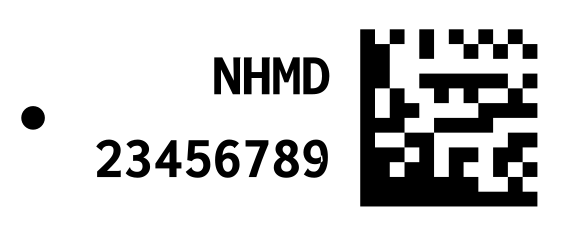
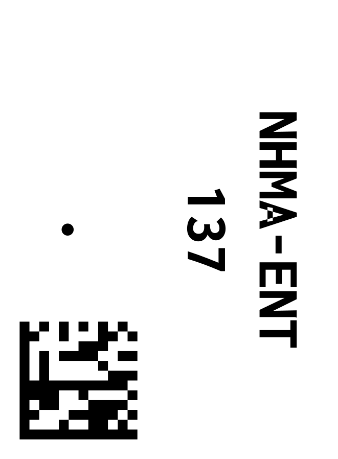

# Pinned Datamatrix Label Generator

| Style | Image |
|-------|-------|
| NHMD  |  |
| NHMA  |  |

## About

Configurable package for use by dassco when creating labels.

## Key Features

- Generate single or double-sided labels.
- Embed labels with text, datamatrices, and pin holes.
- Create labels as vector graphics, making them resolution-independent.
- Embed generated labels into PDF files for ease of printing.

## Installation

Requires Python 3.10 or later.

**Prerequisites**: Ensure that `git` is installed on your system for the following installation methods.

Before installing the `pinned_datamatrix` package, you need to ensure that the `libdmtx` shared library is installed on your system. This library is a requirement for `pylibdmtx`, which the package relies on. Depending on your operating system, you might need to install this library separately:

First open a terminal window.

### For Mac OS X

You can use Homebrew to install `libdmtx`:

```bash
brew install libdmtx
```

### For Linux

You can use the package manager to install `libdmtx`:

```bash
sudo apt-get install libdmtx0b
```

On Windows, please note that the `libdmtx` DLLs are included with the Python wheels, so you don't need to install them separately.

For more detailed information about `pylibdmtx`, you can visit the [pylibdmtx GitHub repository](https://github.com/NaturalHistoryMuseum/pylibdmtx).

Once `libdmtx` is installed (if needed), you can proceed with installing the `pinned_datamatrix` package using either of the following methods:

### 1. Cloning the repository and installing locally

Clone the repository:

```bash
git clone https://github.com/NHMDenmark/pinned-datamatrix-label-generator.git
```

Prepare for installation:

```bash
cd pinned-datamatrix-label-generator
git checkout dassco-label-creator
```

Then, install the package using `pip`:

```bash
python -m pip install .
```

## Usage

1. Command Line Utility:

You generate sheets of labels directly using the command-line interface. The tool can be accessed either via the entry point pinned_datamatrix or using python -m pinned_datamatrix.

Here's how you can view the available options:

```bash
python -m pinned_datamatrix --help
```

This will display:

```bash
Usage: pinned_datamatrix [OPTIONS]

  Generate a PDF with datamatrix labels

Options:
  -s, --style [NHMD|NHMA|NHMD_fish]    The label style  [required]
  -n, --numbers TEXT         The numbers as a range or list  [required]
  -o, --output FILE          The output path of the PDF file  [required]
  -p, --label-padding FLOAT  The padding around the label in mm (default: 0.25)
  --help                     Show this message and exit.
```

Example usage:

**Test creates one matrix and the text NHMD // 000000324 in a test.pdf file**
```bash
python -m pinned_datamatrix -s NHMD_fish -n 324 -o test.pdf
```

**NHMD style labels with numbers 1-1000 and 2000-3000**

```bash
python -m pinned_datamatrix -s NHMD -n 1-1000,2000-3000 -o labels.pdf
```

**NHMA style labels with numbers 10-25 and 123456789 and a label padding of 0.5mm**

```bash
python -m pinned_datamatrix -s NHMA -n 10-25,123456789 -o labels.pdf -p 0.5
```

## Examples

The `examples` directory contains a variety of examples illustrating the use of the package (note these are from previous versions of this library and may not perfectly reflect how the labels look now). These examples include:

- `create_examples.py`: An example script showing how to create datamatrices, labels, and sheets.
- `example_datamatrix.png`, `example_datamatrix.svg`: Examples of datamatrix barcodes.
- `NHMD_label.pdf`, `NHMD_label.png`, `NHMD_label.svg`: Example NHMD style labels.
- `NHMA_label.pdf`, `NHMA_label.png`, `NHMA_label.svg`: Example NHMA style labels.
- `NHMA_doublesided_sheet.pdf`, `NHMD_doublesided_sheet.pdf`: Example double-sided sheets of labels.

## Configuring new styles

Take a look at the pinned_datamatrix/styles.py You can either edit one of the existing styles (recommended - save the style function outcommented so there is no need to edit anywhere else) or add a new one. Adding a new one requires some further updates in the pinned_datamatrix/_main_.py around lines 45 and 75. 

The NHMD_fish style at the bottom of styles.py has descriptions for the fields you would want to edit.

## Tests

The `tests` directory contains unit tests for the package. These tests cover the datamatrix generation, label generation, and sheet generation. To run the tests, you can use the `pytest` command from the root directory of the repository:

```bash
pytest
```

## Licensing

This project is licensed under the terms of the MIT license. See the `LICENSE` file for more details.

## Contribution

As this is a work in progress, contributions are most welcome. Please feel free to raise issues or create pull requests.

## Acknowledgements

This project relies on several open-source packages, including `reportlab`, `pylibdmtx`, `numpy`, `Pillow`, `svglib`, and `rlPyCairo`. Their contributions to the open-source community are greatly appreciated.
